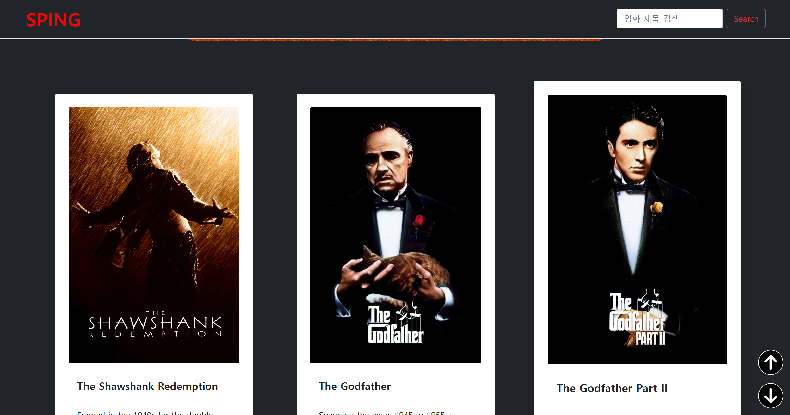
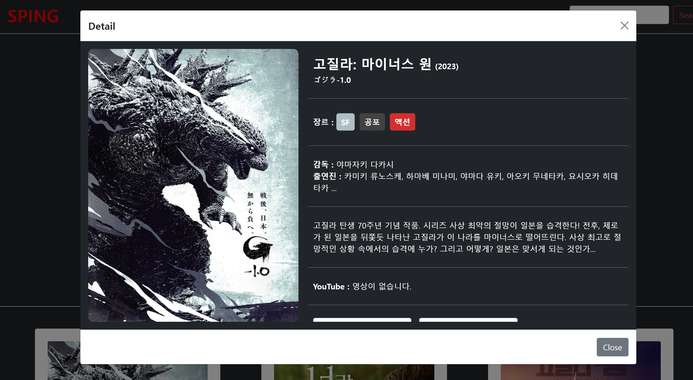
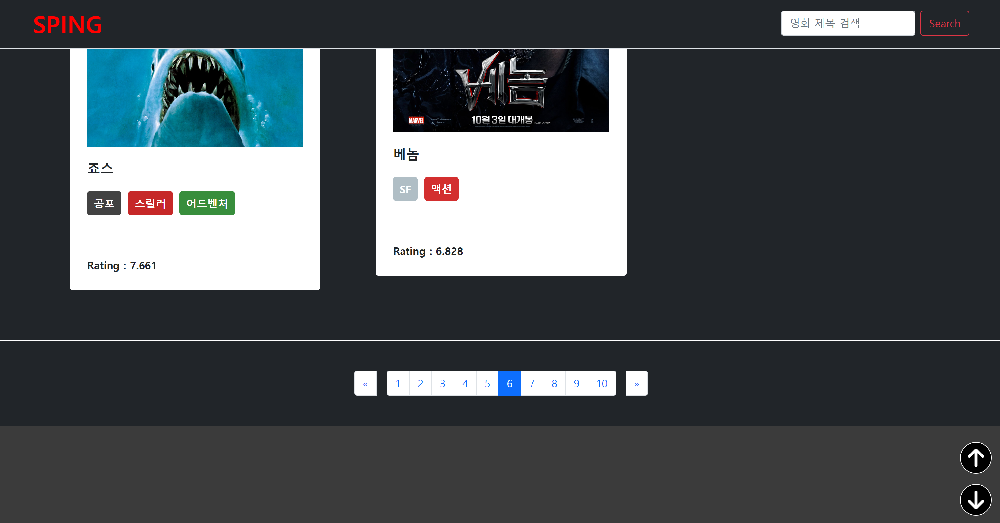
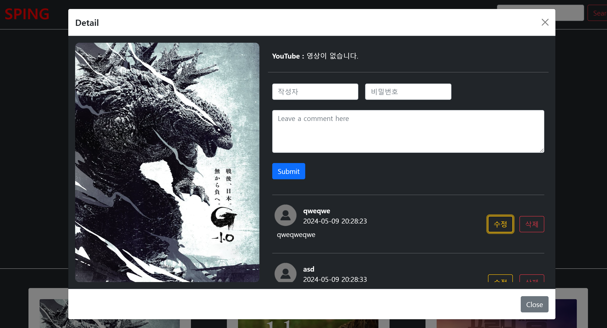
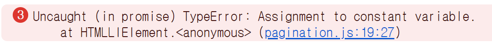

# 🖥️ 영화 검색 사이트 프로젝트


## 프로젝트 소개
- 프로젝트 이름 : SPING(스핑)
- 내용 : 인기 영화 검색 사이트 구현하기
- 구분 : 개인 프로젝트
- GitHub Page : [https://jkc-mycode.github.io/SPING/](https://jkc-mycode.github.io/SPING/)

<br>

## 필수 구현 내용
- 순수 자바스크립트 사용하기 ***( O )***
- TMDB 오픈 API를 이용해서 인기영화 가져오기 ***( O )***
- 영화정보 카드 리스트 UI 구현 ***( O )***
  - title(제목)
  - overview(내용 요약) 
  - poster_path(포스터 이미지 경로)
  - vote_average(평점)
  - 클릭 시 영화 id alert
- 영화검색기능 ***( O )***
- 필요 문법 리스트 ***( O )***
  - const, let 만 사용
  - 화살표 함수 1개이상 사용
  - 배열 메서드 2개 이상 사용
  - DOM 제어 2개 이상 사용

<br>

## 1. 개발 기간
- 2024.04.24 ~ 2024.04.26
- 피드백 수정 : 2024.04.29 (완)
- 1차 추가 구현 : 2024.05.01 ~ 2024.05.10 
  - 사이트 UI 변경
  - 영화 API 변경
  - 리뷰기능 추가
  - 검색기능 수정

<br>

## 2. 개발 환경
- FrontEnd : HTML, CSS, JavaScript, Bootstrap
- API : [TMDB 인기 영화 정보](https://www.themoviedb.org/?language=ko)

<br>

## 3. 주요 기능
### 3-1. TMDB API를 이용한 영화 데이터 가져오기
- TMDB 사이트에서 받은 API 키로 영화 데이터를 가져옴
- TMDB에서 기본적인 코드를 제공함
    ```javascript
    import { movieDataList } from "./script.js";
    import { appendCard } from "./card_append.js";

    const $movieCards = document.querySelector("#movieCards");


    // TMDB API 정보
    const options = {
        method: 'GET',
        headers: {
            accept: 'application/json',
            Authorization: ''
        }
    };

    // TMDB에서 페이지번호에 따라 데이터를 가져오는 함수
    export const loadData = async (pageNum) => {
        try {
            const res = await fetch(`https://api.themoviedb.org/3/movie/top_rated?language=en-US&page=${pageNum}`, options)
            const data = await res.json();
            data.results.forEach(item => {
                appendCard(item.id, item.title, item.overview, item.poster_path, item.vote_average, $movieCards);
                movieDataList.push(item);  // 검색에서 사용할 전역 데이터 리스트
            });
        } catch(err) {
            console.error(err);
        }
    }
    ```

<br>

### 3-2. 영화 제목으로 검색
- 검색창을 이용해서 검색
- 검색창에 입력한 내용과 영화 제목과 비교해서 결과 출력
- 대소문자 구분 없음
- ~~다만, 페이지 단위로 검색이 가능~~
- ~~원래는 10페이지 모두의 데이터를 하나의 변수에 저장할까 고민했지만 일단 페이지 단위로 검색하게 만듦~~
- ~~하나의 변수에 데이터를 저장하는 방식은 데이터베이스와 유사해 보임~~
- ~~**(수정)** 10페이지 이상도 볼 수 있도록 수정~~
- ~~**(수정)** 전역 변수가 아니라 모듈화를 통해서 직접 변수에 접근하지 못하게 함~~
- **(수정)** TMDB에서 제공하는 Search API를 활용
- **(수정)** Search API를 통해서 해당하는 영화를 모두 가져와서 보여줌
    ```javascript
    // 제목으로 영화 검색해서 해당 영화 데이터 fetch
    export const searchMovieData = async (searchText) => {
        try {
            const response = await fetch(`https://api.themoviedb.org/3/search/movie?query=${searchText}&include_adult=false&language=ko-KR&page=1`, options);
            const data = await response.json();
            console.log(data);
            return data.results;
        } catch (err) {
            console.error(err);
        }
    }
    ```
    ```javascript
    // 제목으로 영화 검색
    const searchMovie = async () => {
        if ($searchContent.value === "") {
            window.alert("검색할 제목을 입력해주세요!!");
        } else {
            // 슬라이드 삭제
            $movieSlide.remove();
            // 현재 카드 리스트를 삭제
            $movieCards.replaceChildren();
            const movieData = await searchMovieData($searchContent.value);

            movieData.forEach(item => {
                appendCard(item.id, item.title, item.genre_ids, item.poster_path, item.vote_average, $movieCards);
            });
        }
    }
    ```

<br>

### 3-3. 페이지네이션(Pagination)
- TMDB는 한 페이지당 20개의 영화 데이터만 전송함
- 대신 URL에 페이지를 조절해서 값을 요청할 수 있음
- 그 방법을 이용해서 10페이지 정도의 데이터만 사용
- **(수정)** 10페이지 이상도 출력되도록 만듦
- **(수정)** HTML 코드를 반복문을 통해서 출력
    ```javascript
    import { loadData } from "./data_load.js";
    import { clearMovieDataList } from "./data_manage.js";

    const $movieCards = document.querySelector("#movieCards");
    const $activeClass = document.getElementsByClassName("active");
    const $pageGroup = document.getElementById('page_item_group');
    const $prevGroupPage = document.getElementById('prev_group_page');
    const $nextGroupPage = document.getElementById('next_group_page');
    let groupPage = 1;


    // 현재 그룹 페이지 반환 함수
    export const getGroupPage = () => {
        return groupPage;
    }
    // 그룹 페이지 변수 수정 (이전 그룹 페이지)
    const setPrevGroupPage = () => {
        if (groupPage - 10 > 0) {
            return groupPage -= 10;
        }
    }
    // 그룹 페이지 변수 수정 (다음 그룹 페이지)
    const setNextGroupPage = () => {
        return groupPage += 10;
    }


    // 페이지 그룹 이동 버튼에 이벤트 추가 함수
    export const initPrevNextBtn = () => {
        $prevGroupPage.addEventListener('click', () => {
            setPrevGroupPage();
            $pageGroup.replaceChildren();
            printPagination(getGroupPage());
            $pageGroup.firstChild.click();
        });

        $nextGroupPage.addEventListener('click', () => {
            setNextGroupPage();
            $pageGroup.replaceChildren();
            printPagination(getGroupPage());
            $pageGroup.firstChild.click();
        });
    }


    // Pagination 클릭 이벤트 구현
    const pagination = (item) => {
        item.addEventListener("click", () => {
            // 페이지 버튼의 활성화를 위한 코드
            $activeClass[1].className = $activeClass[1].className.replace(" active", "");
            item.className += " active";
            
            // 기존의 Card 삭제
            $movieCards.replaceChildren();
            clearMovieDataList();  // 페이지 단위로 검색 가능하게 할려고
            loadData(item.value);
            window.scrollTo({ top: 0, behavior: "smooth" });
        });
    }


    // 페이지네이션 출력
    export const printPagination = (startPageNum) => {
        let html_tmp = ``;

        for (let i = 0; i < 10; i++){
            if (i === 0) {
                html_tmp = `<li class="page-item active" value="${startPageNum}"><a class="page-link">${startPageNum}</a></li>`;
            } else {
                html_tmp = `<li class="page-item" value="${startPageNum + i}"><a class="page-link">${startPageNum + i}</a></li>`;
            }
            $pageGroup.insertAdjacentHTML("beforeend", html_tmp);

            let pageBtn = $pageGroup.lastChild;
            pagination(pageBtn);
        }
    }
    ```

<br>

### 3-4. 영화 상세페이지
- 모달 창으로 열리는 영화 상세보기 페이지

- 각 영화 카드의 이미지를 클릭하면 모달 형태로 열림

- 영화의 상세 정보를 가져오기 위해서 TMDB의 Detail API를 사용
    ```javascript
    // 모달 창을 동적으로 열어주는 함수
    export const showModal = async (id) => {
        // 모달 창 내용 초기화
        clearModalContent();

        // id 기반으로 TMDB에서 상세 데이터 fetch
        loadDetailData(id)
            .then((movieDetailData) => {
                // 장르의 id 값만 추출
                const genreArr = [];
                for (let item of movieDetailData.genres) {
                    genreArr.push(item.id);
                }
                // 장르 HTML 형식 코드를 반환 받음
                const genre_tmp = appendGenre(genreArr);

                $moviePoster.insertAdjacentHTML("beforeend",
                    ``
                );
                $movieTitle.insertAdjacentHTML("beforeend",
                    `<b><span class="movie_title_kr">${movieDetailData.title}</span></b>
                    <b><span>(${movieDetailData.release_date.substr(0, 4)})</span></b><br>
                    <b><span>${movieDetailData.original_title}</span></b>`
                );
                $movieGenre.insertAdjacentHTML("beforeend",
                    `<span><b>장르 : </b>${genre_tmp}</span>`
                );
                $movieOverview.insertAdjacentHTML("beforeend",
                    `<span>${movieDetailData.overview}</span>`
                );
            });


        // id 기반으로 TMDB에서 출연진 데이터 fetch
        loadCastData(id)
            .then((movieCastData) => {
                // cast 이름 데이터 가공
                let castName = '';
                let count = 0;

                for (let item of movieCastData.cast) {
                    castName += item.name;
                    count++;

                    if (count === 5) break;
                    else castName += ', '
                }

                $movieCast.insertAdjacentHTML("beforeend",
                    `<span><b>감독 : </b>${movieCastData.crew[0].name}</span><br>
                    <span><b>출연진 : </b>${castName} ...</span>`
                )
            })


        // id 기반으로 TMDB에서 비디오 경로 fetch
        loadVideoData(id)
            .then((movieVideoData) => {
                // 영상이 없을 경우 따로 처리
                let movieVideoDataForm = checkVideoData(movieVideoData);

                $movieYoutubeLink.insertAdjacentHTML("beforeend",
                    `<span><b>YouTube : </b>
                        ${movieVideoDataForm}
                    </span>`
                )
            })

        loadReviewForm(id);

        loadReview(id);

        // 다시 클릭 가능하게 만들어줌
        $modalBox.addEventListener('hide.bs.modal', () => {
            document.getElementById(`img_${id}`).classList.remove('disable-pointer');
        });

        // 직접 부트스트랩의 Modal 객체를 만들어서 동작시킴
        const modalInstance = new bootstrap.Modal($modalBox);
        await modalInstance.show();
    }
    ```


<br>

### 3-5. 영화 리뷰 작성 기능
- 영화 상세페이지의 우측에서 영화에 대한 리뷰 작성 가능

- 리뷰 데이터는 localStorage에 저장됨

- 리뷰마다 고유 ID가 존재해서 수정, 삭제가 가능
    ```javascript
    // 리뷰 저장하는 함수
    export const saveReview = (id) => {
        let date = new Date();

        let year = date.getFullYear();
        let month = ('0' + (date.getMonth() + 1)).slice(-2)
        let days = ('0' + date.getDate()).slice(-2)
        let hours = ('0' + date.getHours()).slice(-2)
        let minutes = ('0' + date.getMinutes()).slice(-2)
        let seconds = ('0' + date.getSeconds()).slice(-2)

        let day = year + '-' + month + '-' + days + " " + hours + ":" + minutes + ":" + seconds

        const review = {
            movieId: id,
            reviewer: document.getElementById("reviewer").value,
            reviewPass: document.getElementById("review_pass").value,
            reviewContent: document.getElementById("review_content").value,
            dateTime: day
        }
        localStorage.setItem(crypto.randomUUID(), JSON.stringify(review));
        console.log(localStorage);
    }


    // 리뷰 리스트 로드하는 함수
    export const loadReview = (id) => {
        let searchReviews = [];
        for (let i = 0; i < localStorage.length; i++) {
            let key = localStorage.key(i);
            let value = localStorage.getItem(key);

            if (JSON.parse(value).movieId === id) {
                searchReviews.push([key, JSON.parse(value)]);
            }
        }
        console.log(searchReviews);
        searchReviews.sort((a, b) => a[1].dateTime < b[1].dateTime ? -1 : 1);
        console.log(searchReviews);

        document.getElementById("movie_review_list_box").innerHTML = " ";
        searchReviews.forEach((item) => {
            let review_list_tmp = `
            <hr>
            <div class="movie_review_list">
                <div class="review_list_left">
                    <div class="review_img_name_date">
                        <div class="review_img_box">
                            
                        </div>
                        <div class="review_name_date">
                            <p><b>${item[1].reviewer}</b></p>
                            <p>${item[1].dateTime}</p>
                        </div>
                    </div>
                    <div class="review_content">
                        <p>${item[1].reviewContent}</p>
                    </div>
                </div>
                <div class="review_list_right">
                    <div class="update_btn">
                        <button id="update_btn_${item[0]}" type="button" class="btn btn-outline-warning">수정</button>
                    </div>
                    <div class="delete_btn">
                        <button id="delete_btn_${item[0]}" type="button" class="btn btn-outline-danger">삭제</button>
                    </div>
                </div>
            </div>
            `
            document.getElementById("movie_review_list_box").insertAdjacentHTML("beforeend", review_list_tmp);

            document.getElementById(`update_btn_${item[0]}`).addEventListener("click", () => {
                updateReview(item[0]);
            });

            document.getElementById(`delete_btn_${item[0]}`).addEventListener("click", () => {
                deleteReview(item[0]);
            });
        })

    }


    // 리뷰 수정하는 함수
    export const updateReview = (reviewId) => {
        const reviewData = JSON.parse(localStorage.getItem(reviewId));

        if (prompt("비밀번호를 입력해주세요.", "") === reviewData.reviewPass) {
            reviewData.reviewer = prompt("작성자를 입력해주세요.", reviewData.reviewer);
            reviewData.reviewContent = prompt("내용을 입력해주세요.", reviewData.reviewContent);
            reviewData.reviewPass = prompt("내용을 입력해주세요.", "");
            localStorage.removeItem(reviewId);
            localStorage.setItem(reviewId, JSON.stringify(reviewData));
            alert("변경되었습니다!");
            loadReview(reviewData.movieId);
        } else {
            alert("비밀번호가 틀렸습니다!!");
        }
    }


    // 리뷰 삭제하는 함수
    export const deleteReview = (reviewId) => {
        const reviewData = JSON.parse(localStorage.getItem(reviewId));

        if (prompt("비밀번호를 입력해주세요.", "") === reviewData.reviewPass) {
            localStorage.removeItem(reviewId);
            alert("삭제 되었습니다");
            loadReview(reviewData.movieId);
        } else {
            alert("비밀번호가 틀렸습니다!!");
        }
    }
    ```


<br>

## 4. 페이지 사진 첨부
- 사이트 메인


- 사이트 메인 영화 정보


- 영화 상세페이지


- 영화 검색 결과


- 페이지네이션


- 페이지 변경 결과


- 리뷰 작성 기능



<br>

## 5. 어려웠던 점
### 5-1. document.querySelector()로 innerHTML이 동작하지 않음
- innerHTML은 기존 요소를 파싱하기 때문에 비싼 DOM 작업을 필요로 함
- 요소(element)의 내용을 변경하는 대신 HTML을 문서(document)에 삽입하려면, insertAdjacentHTML() 메서드를 사용
- 따라서 기존 요소를 파싱하지 않는 insertAdjacentHTML을 사용하면 작업을 빠르게 완료할 수 있음


<br>

### 5-2. 카드 Hover 시 커스텀 커서가 변하지 않음
- 카드, 이미지, 버튼, a 태그 등에 Hover하면 커서가 변하는 코드를 구현함
- 고정적으로 존재하는 이미지나 버튼 등은 커서가 제대로 동작했음
- 하지만 카드는 Hover 해도 커서에 변화가 없음


- 원인은 카드가 다 출력되지 않았는데 카드를 Hover 시 변화를 주라고 해서 동작하지 않음
- 그래서 async/await 구문을 통해서 fetch와 appendCard()함수를 기다리고 커서 변화 함수를 사용하도록 만듦
  
```javascript
// TMDB에서 페이지번호에 따라 데이터를 가져오는 함수
const loadData = async (pageNum) => {
    try {
        const res = await fetch(`https://api.themoviedb.org/3/movie/top_rated?language=en-US&page=${pageNum}`, options)
        const data = await res.json();
        data.results.forEach(item => {
            appendCard(item.id, item.title, item.overview, item.poster_path, item.vote_average, $movieCards);
            movieDataList.push(item);  // 검색에서 사용할 전역 데이터 리스트
        });

        // 커서 모양 변화 함수
        // cursorChange();
    } catch(err) {
        console.error(err);
    }
}
```

<br>

### 5-3. 모듈화 시 변수가 상수로 처리됨
- 모듈화할 때 import한 변수가 상수로 인식 됨
- import를 사용하여 가져온 변수는 재할당할 수 없게 됨
- 일종의 상수(const)처럼 취급됨
- 이것은 import된 변수의 참조를 보호하기 위한 설계라고 함
- 그래서 재할당하는 방식이 아닌 배열의 속성을 바꾸는 방법을 사용
  

    ```javascript
    // 기존 (import한 변수에 재할당)
    movieDataList = [];


    // 변경 (속성을 변경해서 배열을 비움)
    movieDataList.length = 0;

    // 참고 : https://kimk2062.tistory.com/24
    ```

<br>

### 5-4. 전역변수 모듈화
- 피드백으로 전역변수말고 다른 방법을 사용하라고 피드백 받음
- 객체지향프로그래밍의 요소 중 캡슐화를 사용
- 데이터가 들어있는 변수에 직접 접근하지 못하도록 수정
- 그 변수를 사용하기 위해서는 만들어진 함수를 통해서 접근
    ```javascript
    let movieDataList = [];

    export const getMovieDataList = () => {
        return movieDataList;
    }

    export const addMovieData = (item) => {
        movieDataList.push(item);
    }

    export const clearMovieDataList = () => {
        movieDataList.length = 0;
    }
    ```

<br>

### 5-5. 페이지네이션 10페이지 이상으로 수정
- 기존에는 10페이지에 해당하는 데이터만 볼 수 있었음
- 피드백 이후 페이지네이션 버튼을 자바스크립트로 관리할 수 있도록 수정
- 그렇기에 printPagination() 등 필요한 함수를 구현
- 함수들간에 실행 순서에서 시간을 많이 소모함
    ```javascript
    import { loadData } from "./data_load.js";
    import { clearMovieDataList } from "./data_manage.js";

    const $movieCards = document.querySelector("#movieCards");
    const $activeClass = document.getElementsByClassName("active");
    const $pageGroup = document.getElementById('page_item_group');
    const $prevGroupPage = document.getElementById('prev_group_page');
    const $nextGroupPage = document.getElementById('next_group_page');
    let groupPage = 1;


    // 현재 그룹 페이지 반환 함수
    export const getGroupPage = () => {
        return groupPage;
    }
    // 그룹 페이지 변수 수정 (이전 그룹 페이지)
    const setPrevGroupPage = () => {
        if (groupPage - 10 > 0) {
            return groupPage -= 10;
        }
    }
    // 그룹 페이지 변수 수정 (다음 그룹 페이지)
    const setNextGroupPage = () => {
        return groupPage += 10;
    }


    // 페이지 그룹 이동 버튼에 이벤트 추가 함수
    export const initPrevNextBtn = () => {
        $prevGroupPage.addEventListener('click', () => {
            setPrevGroupPage();
            $pageGroup.replaceChildren();
            printPagination(getGroupPage());
            $pageGroup.firstChild.click();
        });

        $nextGroupPage.addEventListener('click', () => {
            setNextGroupPage();
            $pageGroup.replaceChildren();
            printPagination(getGroupPage());
            $pageGroup.firstChild.click();
        });
    }


    // Pagination 클릭 이벤트 구현
    const pagination = (item) => {
        item.addEventListener("click", () => {
            // 페이지 버튼의 활성화를 위한 코드
            $activeClass[1].className = $activeClass[1].className.replace(" active", "");
            item.className += " active";
            
            // 기존의 Card 삭제
            $movieCards.replaceChildren();
            clearMovieDataList();  // 페이지 단위로 검색 가능하게 할려고
            loadData(item.value);
            window.scrollTo({ top: 0, behavior: "smooth" });
        });
    }


    // 페이지네이션 출력
    export const printPagination = (startPageNum) => {
        let html_tmp = ``;

        for (let i = 0; i < 10; i++){
            if (i === 0) {
                html_tmp = `<li class="page-item active" value="${startPageNum}"><a class="page-link">${startPageNum}</a></li>`;
            } else {
                html_tmp = `<li class="page-item" value="${startPageNum + i}"><a class="page-link">${startPageNum + i}</a></li>`;
            }
            $pageGroup.insertAdjacentHTML("beforeend", html_tmp);

            let pageBtn = $pageGroup.lastChild;
            pagination(pageBtn);
        }
    }
    ```