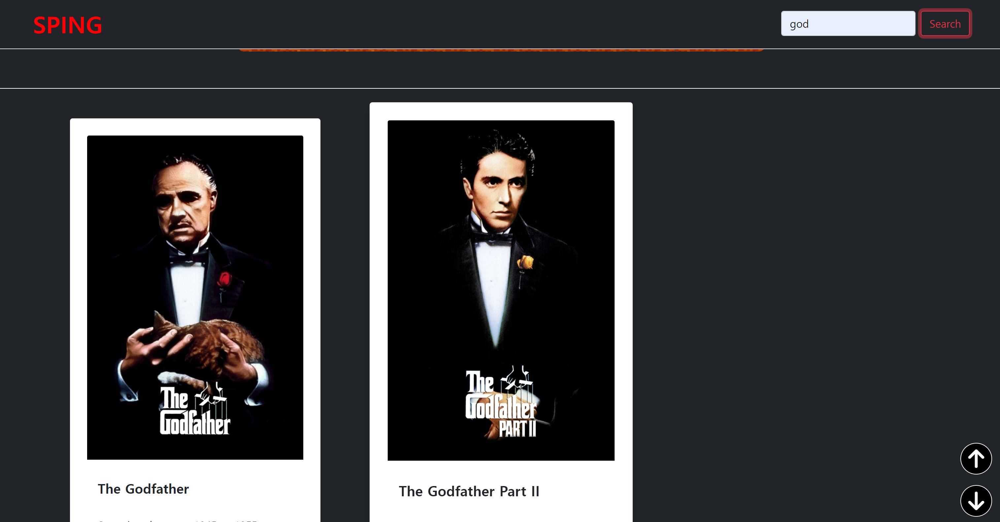
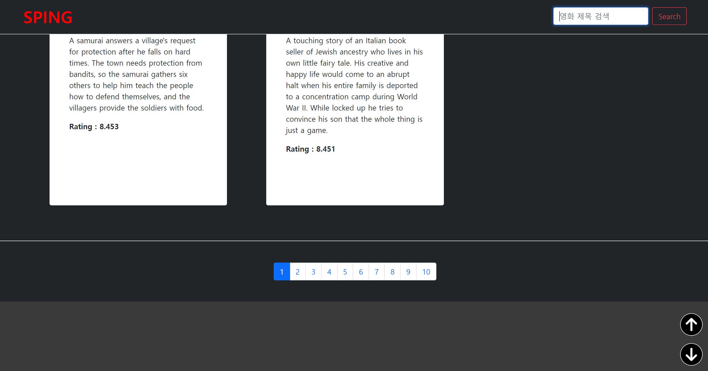
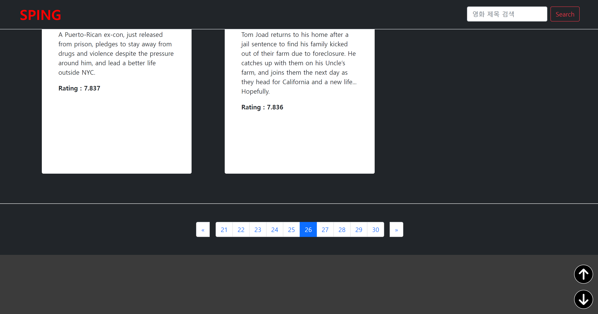
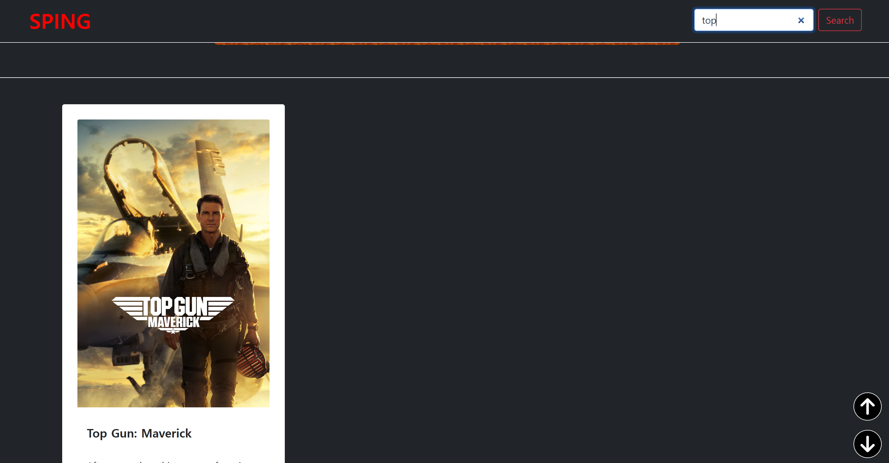

# 🖥️ 영화 검색 사이트 프로젝트


## 프로젝트 소개
- 프로젝트 이름 : SPING(스핑)
- 내용 : 인기 영화 검색 사이트 구현하기
- 구분 : 개인 프로젝트
- GitHub Page : [https://jkc-mycode.github.io/Movie_Site/](https://jkc-mycode.github.io/Movie_Site/)

<br>

## 1. 개발 기간
- 2024.04.24 ~ 2024.04.26

<br>

## 2. 개발 환경
- FrontEnd : HTML, CSS, JavaScript, Bootstrap
- API : [TMDB 인기 영화 정보](https://www.themoviedb.org/?language=ko)

<br>

## 3. 주요 기능
### 3-1. TMDB API를 이용한 영화 데이터 가져오기
- TMDB 사이트에서 받은 API 키로 영화 데이터를 가져옴
- TMDB에서 기본적인 코드를 제공함
    ```javascript
    import { movieDataList } from "./script.js";
    import { appendCard } from "./card_append.js";

    const $movieCards = document.querySelector("#movieCards");


    // TMDB API 정보
    const options = {
        method: 'GET',
        headers: {
            accept: 'application/json',
            Authorization: ''
        }
    };

    // TMDB에서 페이지번호에 따라 데이터를 가져오는 함수
    export const loadData = async (pageNum) => {
        try {
            const res = await fetch(`https://api.themoviedb.org/3/movie/top_rated?language=en-US&page=${pageNum}`, options)
            const data = await res.json();
            data.results.forEach(item => {
                appendCard(item.id, item.title, item.overview, item.poster_path, item.vote_average, $movieCards);
                movieDataList.push(item);  // 검색에서 사용할 전역 데이터 리스트
            });
        } catch(err) {
            console.error(err);
        }
    }
    ```

<br>

### 3-2. 영화 제목으로 검색
- 검색창을 이용해서 검색
- 검색창에 입력한 내용과 영화 제목과 비교해서 결과 출력
- 대소문자 구분 없음
- 다만, 페이지 단위로 검색이 가능
- 원래는 10페이지 모두의 데이터를 하나의 변수에 저장할까 고민했지만 일단 페이지 단위로 검색하게 만듦
- 하나의 변수에 데이터를 저장하는 방식은 데이터베이스와 유사해 보임
    ```javascript
    import { movieDataList } from "./script.js";
    import { appendCard } from "./card_append.js";

    const $movieCards = document.querySelector("#movieCards");
    const $searchContent = document.getElementById("search_content");
    const $searchBtn = document.getElementById("search_btn");


    // 제목으로 영화 검색
    const searchMovie = () => {
        if ($searchContent.value === "") {
            window.alert("검색할 제목을 입력해주세요!!");
        } else {
            // 현재 카드 리스트를 삭제
            $movieCards.replaceChildren();
            movieDataList.filter((item) => {
                // 제목과 입력한 내용을 전부 소문자로 바꿔서 비교
                let lowerTitle = item.title.toLowerCase();
                let lowerContent = $searchContent.value.toLowerCase();

                if (lowerTitle.includes(lowerContent)) {
                    appendCard(item.id, item.title, item.overview, item.poster_path, item.vote_average, $movieCards);
                }
            });
        }
    }

    // 버튼에 클릭으로 검색 이벤트 추가
    export const searchBtn = () => {
        $searchBtn.addEventListener("click", () => {
            searchMovie();
        });
    }


    // 엔터 입력 시 검색 이벤트 추가
    export const searchEnter = () => {
        window.addEventListener("keydown", (event) => {
            if (event.code === "Enter") {
                searchMovie();
            }
        });
    }

    ```

<br>

### 3-3. 페이지네이션(Pagination)
- TMDB는 한 페이지당 20개의 영화 데이터만 전송함
- 대신 URL에 페이지를 조절해서 값을 요청할 수 있음
- 그 방법을 이용해서 10페이지 정도의 데이터만 사용
```javascript
import { movieDataList } from "./script.js";
import { loadData } from "./data_load.js";

const $movieCards = document.querySelector("#movieCards");
const $pageValue = document.querySelectorAll(".page-item");
const $activeClass = document.getElementsByClassName("active");


// 유사 Pagination 구현
export const pagination = () => {
    $pageValue.forEach((item) => {
        item.addEventListener("click", async () => {
            // 페이지 버튼의 활성화를 위한 코드
            $activeClass[1].className = $activeClass[1].className.replace(" active", "");
            item.className += " active";
            
            // 기존의 Card 삭제
            $movieCards.replaceChildren();
            movieDataList.length = 0  // 페이지 단위로 검색 가능하게 할려고
            await loadData(item.value);
            window.scrollTo({ top: 0, behavior: "smooth" });
        });
    });
}
```

<br>

## 4. 페이지 사진 첨부
- 사이트 메인


- 사이트 메인 영화 정보


- 영화 검색 결과1


- 페이지네이션


- 페이지 변경 결과


- 페이지네이션


- 변경된 페이지에서의 검색


<br>

## 5. 어려웠던 점
### 5-1. document.querySelector()로 innerHTML이 동작하지 않음
- innerHTML은 기존 요소를 파싱하기 때문에 비싼 DOM 작업을 필요로 함
- 요소(element)의 내용을 변경하는 대신 HTML을 문서(document)에 삽입하려면, insertAdjacentHTML() 메서드를 사용
- 따라서 기존 요소를 파싱하지 않는 insertAdjacentHTML을 사용하면 작업을 빠르게 완료할 수 있음


### 5-2. 카드 Hover 시 커스텀 커서가 변하지 않음
- 카드, 이미지, 버튼, a 태그 등에 Hover하면 커서가 변하는 코드를 구현함
- 고정적으로 존재하는 이미지나 버튼 등은 커서가 제대로 동작했음
- 하지만 카드는 Hover 해도 커서에 변화가 없음


- 원인은 카드가 다 출력되지 않았는데 카드를 Hover 시 변화를 주라고 해서 동작하지 않음
- 그래서 async/await 구문을 통해서 fetch와 appendCard()함수를 기다리고 커서 변화 함수를 사용하도록 만듦
  
```javascript
// TMDB에서 페이지번호에 따라 데이터를 가져오는 함수
const loadData = async (pageNum) => {
    try {
        const res = await fetch(`https://api.themoviedb.org/3/movie/top_rated?language=en-US&page=${pageNum}`, options)
        const data = await res.json();
        data.results.forEach(item => {
            appendCard(item.id, item.title, item.overview, item.poster_path, item.vote_average, $movieCards);
            movieDataList.push(item);  // 검색에서 사용할 전역 데이터 리스트
        });

        // 커서 모양 변화 함수
        // cursorChange();
    } catch(err) {
        console.error(err);
    }
}
```